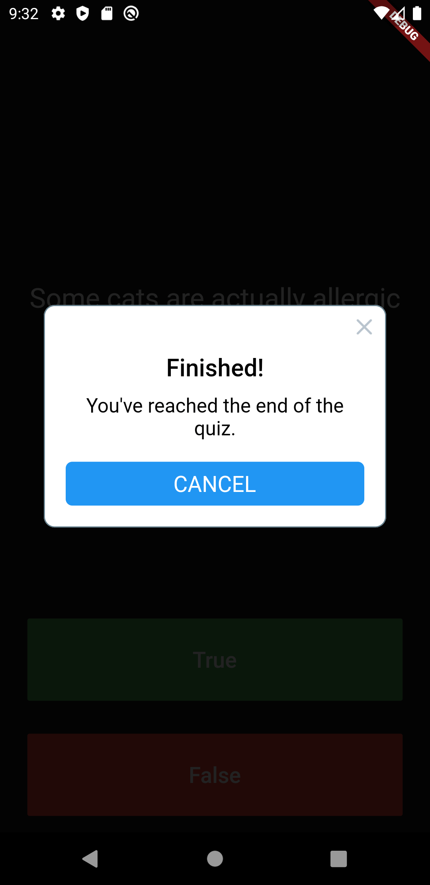
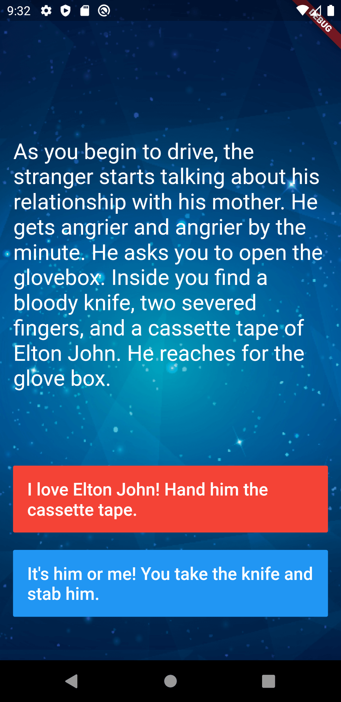
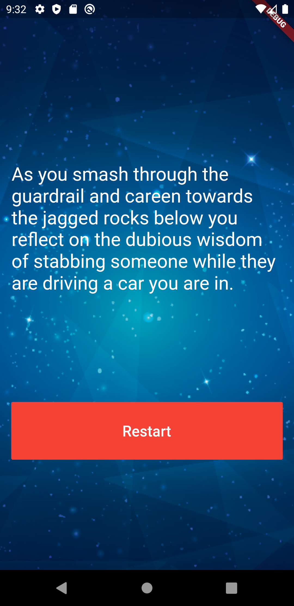
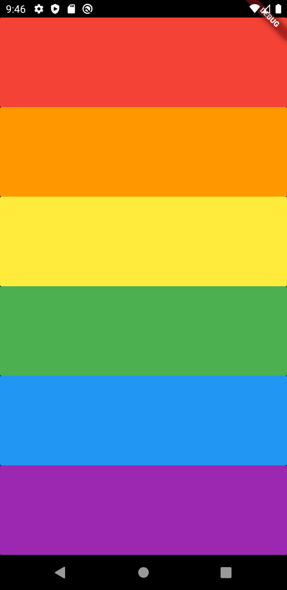
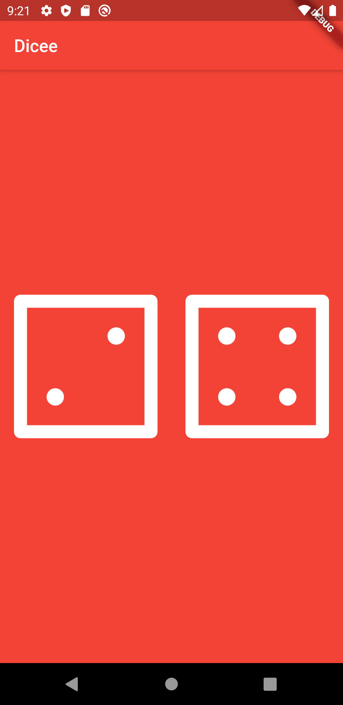

# Flutter introductory course

This repo is a resume of all the codes challenge from the  Flutter introductory course by Appbrewery. 

## Course notes

Here a link from all my notes in the course, if there is something wrong like typo, misconception, or you want to add a new note, please let me know. 

[Notes](https://docs.google.com/document/d/1akcfT8jodu52h22Vea4-0e_ifsklXcdMXEgscQD-Ms0/edit?usp=sharing)

## Projects
          
### Quizzler

* Quizz App

    
    

### Destiny Challenge Starting 

* Storyline App

    
    
    

### Mi Card

* Presentation Card app

    

### Magic 8 ball

* Magic 8 replication App Ref: [Magic 8](https://en.wikipedia.org/wiki/Magic_8-Ball)

    
    
    

### Xylophone

* Xylophone replication app

    

### Intro Flutter App      

* Simple counter App

    

### Dicee

* Random dice generator

    

### I Am Poor

* Simple App Stucture

    

### I Am Rich             

* Simple App Stucture

    
